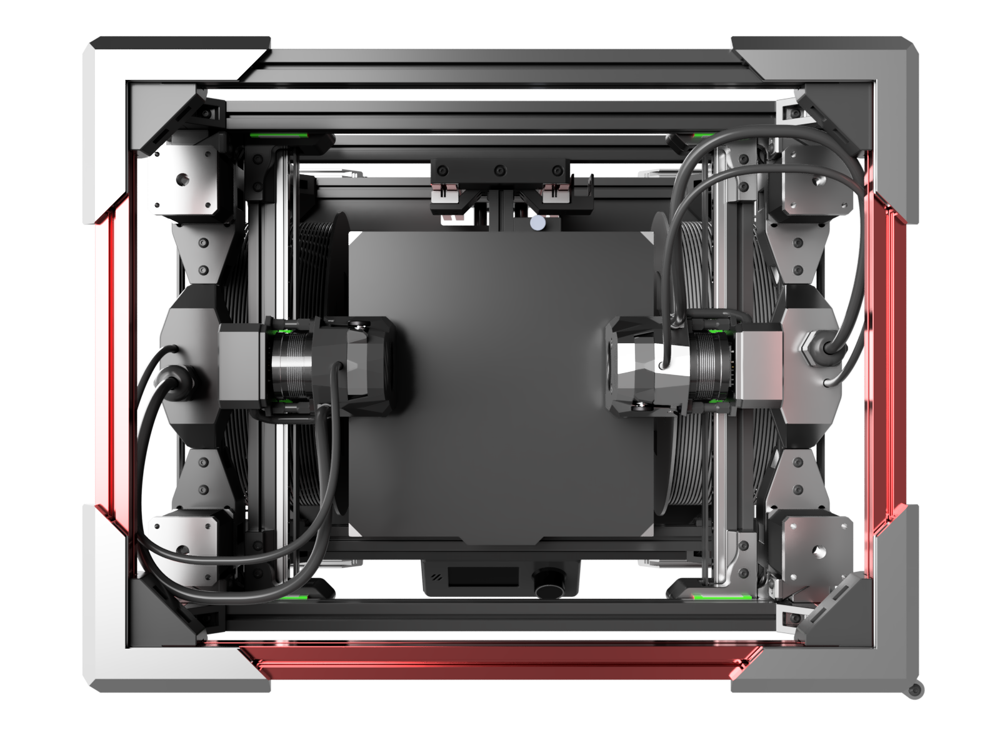
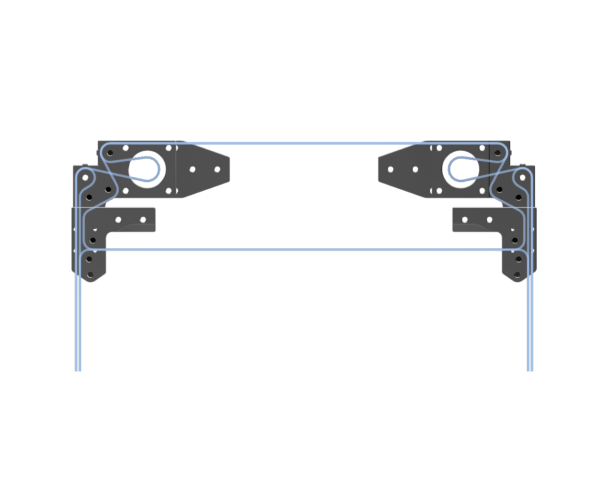
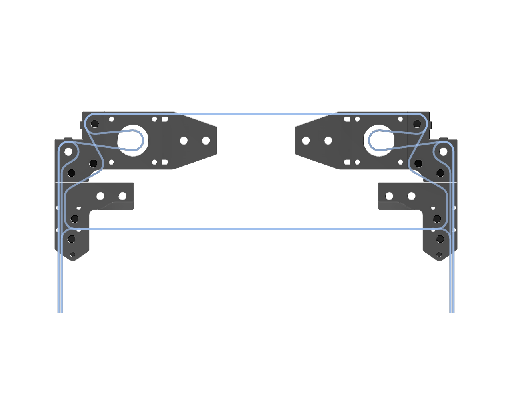
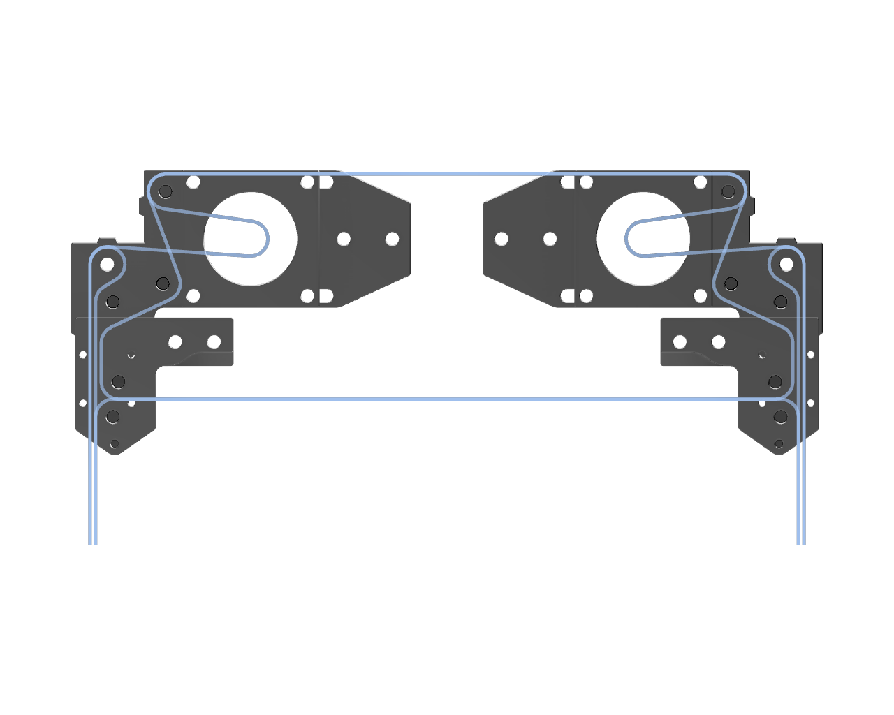
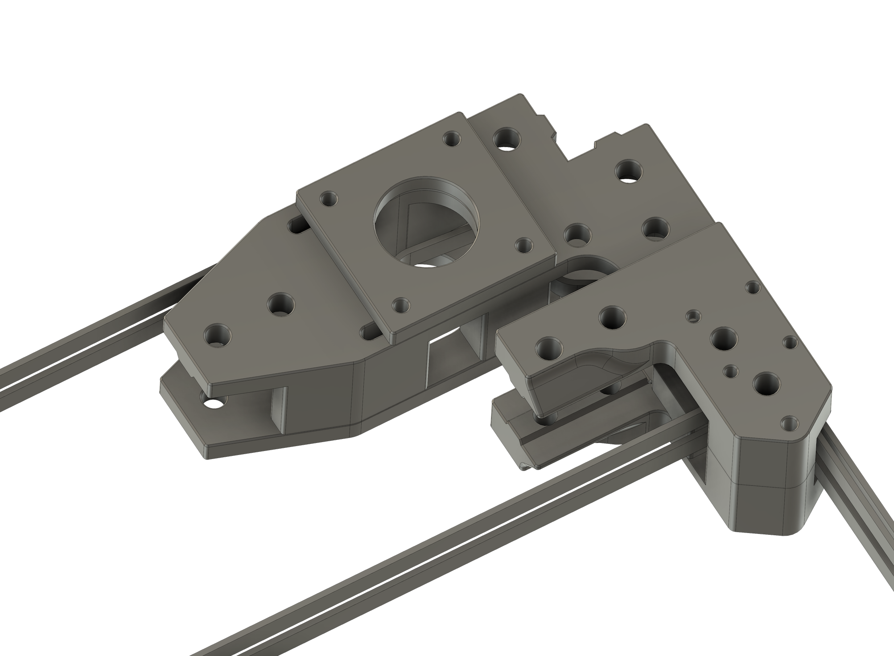
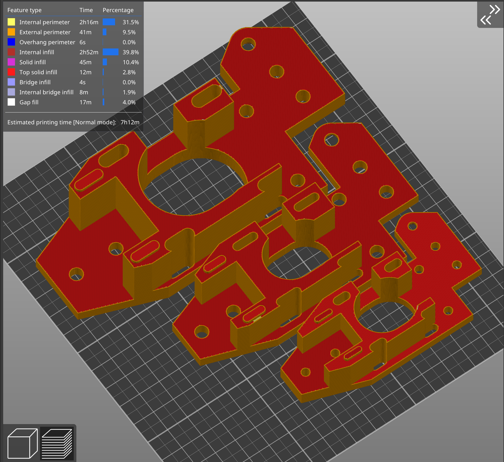
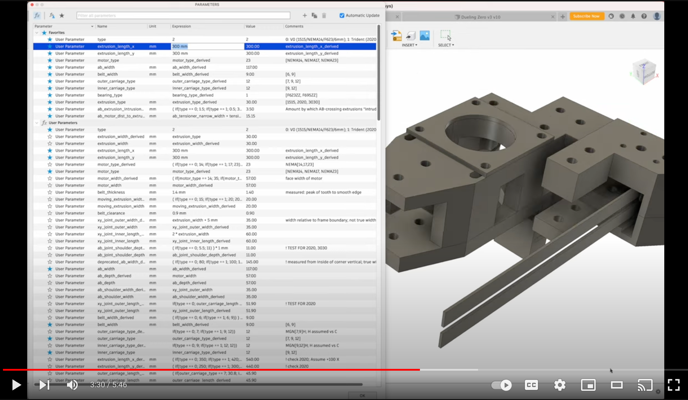
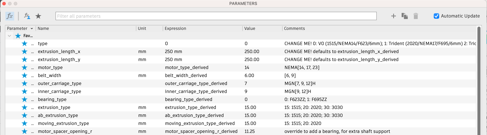
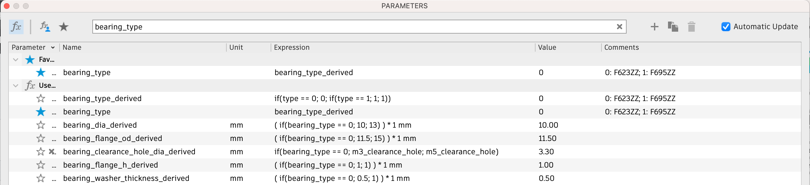
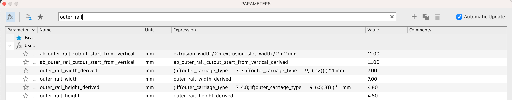

# Dueling X

**Dueling X (DX) is a flexible Fusion 360 CAD file to enable your own Dual Gantry (DG) 3D printer.**

**Dual Gantry** printers are _badass dual-head speed demons_.  

They have all the benefits of two toolheads, without the speed disadvantages inherent in IDEX printers, or the complexity and risk inherent in toolchangers.   [Here's one (Dueling Zero v3)](https://github.com/zruncho3d/DuelingZero):

Not your average printer, right?  In short, the mechanical side of DG is reasonably mature, but the configuration and calibration side is still developing... so, consider it scary-but-exciting territory, for the adventurous.

**Dueling X** is a parametric gantry design based on the original Dueling Zero v3 symmetric gantry, built to enable larger and more varied DG printers.  Use the larger extrusions, rails, motors, from a Voron Trident kit, or customize the build for whatever you have on hand.

This is *not* a complete printer generator, yet.  Think of it as a printed-part generator for a gantry, with stock sizes ready to go, but which still enables customizations.  From above, the printed parts and belts paths look like this, to scale:

| Type 0 (V0 parts): Medium | Type 1 (Trident parts): Large | Type 2 (Trident Maximus parts): XL | Your own parts! |
| - | - | - | - |
|  |  |  | **?...** |
| 1515/NEMA14/F623/6mm/MGN7+9 | 2020/NEMA17/F695/6mm/MGN9+12 | 3030+2020/F695/9mm/MGN12 | **?...** |

Similar shapes, yet completely different "parts bins" and sizes!

| Sample iso view | 3 stock sizes on one plate |
| - | - |
|  |  |

The STLs above were generated by changing the `type` value between the 3 values, waiting a few seconds for the model to recompute, and exporting an STL after each change.

Main features of DX:
* **3 stock sizes (medium, large, XL)**, where each uses a different parts kit (Voron Zero, Voron Trident, Trident Maximus), but can still be customized to your preferred parts.  See the Standard Configurations table below.
* **Pandora-derived gantry**, for the win.  Top-mount outer rails, with bearings above, yields high XY density (build area relative to frame area).  
* **Front-facing toolhead rail** enables:
  * compatibility with many carriages, including small ones (Micron, Boop,...) and large ones (Clockwork, Archetype Core, ...)  
  * compatibility with many toolheads, including small ones (Dragon Burner, MiniSB, ...) and large ones (Stealthburner, Xol, Archteype, ...)
* **Symmetric design**: like the Dueling Zero v3 gantry from which it derives, Dueling X is symmetric, which heavily reduces the custom-plastic-parts count and complexity.  The P shape of the belts in a CoreXY printer are carefully nested in the XY plane, which has all kinds of benefits relative to prior approaches, at only the cost of about 10mm travel.

What makes this model possible?  Heavy use of parameters and equations in the Fusion 360 CAD.  See [this walkthrough video](https://www.youtube.com/watch?v=n0W37SkbVsI) for an explanation of how conditional parameters and naming conventions work in this file.  In the future, as Fusion 360 Configurations become available, managing the configurations may become even easier!

Take a look around... DG printers are weird and wonderful, yet suprisingly practical, and I'm hoping to see more builds, now that the 2020 options are available.

Like what you see?  [Buy me a coffee](https://ko-fi.com/zruncho3d) to show the love and enable future mods and content, stuff like [F0](https://github.com/zruncho3d/f-zero), [T0](https://github.com/zruncho3d/tri-zero), [B0](https://github.com/zruncho3d/boxzero), [X0](https://github.com/zruncho3d/double-dragon), [D0](https://github.com/zruncho3d/DuelingZero), [ZeroPanels](https://github.com/zruncho3d/ZeroPanels), [NoDropNuts](https://github.com/zruncho3d/f-zero/tree/main/STLs/NoDropNuts), [Boop](https://github.com/PrintersForAnts/Boop) improvements, and more.

:heart: *-Zruncho*

### What's Here?

Tons of content: a CAD file, plus documentation to make the most of it.

- #### [Stock Sizes](#standardconfigurations): Choose your favorite stock size!
- #### [Custom Builds](CUSTOM.md): Customize to fit your choice of parts!
- #### [FAQ](#samplebuilds): Common questions
- #### [BOM](BOM.md): Parts for stock sizes
- #### [Bugs](BUGS.md): Known issues and areas that may change
- #### [Changelog](CHANGELOG.md), [Credits](#credits) and [Support](#support)

### Standard Configurations

Each release is tested for 3 standard configurations.  Each of these three configurations (in the CAD, set by the `type` parameter to 0, 1, or 2) draws from a common “parts bin”.

<table>
  <tr>
   <td>Type
   </td>
   <td>“Parts Bin”
   </td>
   <td>Extrusions
   </td>
   <td>Bearings
   </td>
   <td>Motors
   </td>
   <td>Outer Rails
   </td>
   <td>Inner Rails
   </td>
   <td>Belt Width
   </td>
   <td>Belt Gap
   </td>
  </tr>
  <tr>
   <td>0

(default)
   </td>
   <td>V0
   </td>
   <td>1515
   </td>
   <td>F623
   </td>
   <td>NEMA14
   </td>
   <td>MGN7H
   </td>
   <td>MGN9H
   </td>
   <td>6mm
   </td>
   <td>3mm
   </td>
  </tr>
  <tr>
   <td>1
   </td>
   <td>Trident/V2
   </td>
   <td>2020
   </td>
   <td>F696
   </td>
   <td>NEMA17
   </td>
   <td>MGN9H
   </td>
   <td>MGN9H
   </td>
   <td>6mm
   </td>
   <td>4mm
   </td>
  </tr>
  <tr>
   <td>2
   </td>
   <td>Trident Maximus
   </td>
   <td>3030+ 2020
   </td>
   <td>F695
   </td>
   <td>NEMA23
   </td>
   <td>MGN12H
   </td>
   <td>MGN12H
   </td>
   <td>9mm
   </td>
   <td>4mm
   </td>
  </tr>
  <tr>
   <td>Custom
   </td>
   <td colspan="8" >Whatever you have… any of the choices above, via parameter overrides.
   </td>
  </tr>
</table>

Overrideable parameters, mostly for subtypes, look like this:

Lots of dimensions are then set automatically, based on these configured subtypes.  For example, the bearing type drives the bearing's flange width, ID, OD, and height dimensions, as well as the corresponding washer thickness:

### Properly Parametric Design... it's hard

In a “properly parametric” design, every parameter based on an underlying configuration type (think: medium, large, XL) has a type-dependent value.

Here's an example of setting rail sizes, based on the main `type` value (see the `_derived` expressions):

This approach is a pain to get right, but it drastically reduces your effort to make a customized gantry design, and it makes things maintainable for the creator.  After setting the `type`, you can go straight to exporting STLs, though you’ll probably want to do a few more things:
* design X and Y endstops
* add bearings, a carriage, and toolheads to the generate CAD
* tweak a few parameters, if customizing anything
... but all of that is straightforward and explained within this repo.

You'll also need a printer frame around it, of course.

Beyond "just" being properly parametric, this design is scalable, where many parameters are set using an equation, rather than being hard-coded based on a few types.  However, if a parameter isn't working for you - that is, it causes a misalignment with your parts, or just doesn't look right - all key parameters are overrideable anyway, as the CAD uses a convention where each parameter is set by default to a corresponding `_derived` value.  You can always change this value, and you'll know exactly what to set the model back to later if you want to restore the default (the same name, plus `_derived`).  Poke around in the parameters list and you'll see many `_derived` values.

## What’s the status?

**Alpha.**  It’s a soft launch.  There’s one place to see changes and CAD files, with all dev in the open… but any future release may change parts and designs in a way that invalidates _everything you just printed_.  Alpha here means _anything may change_.

**However,** the quality standard is unusually high: for any update, all standard types will have documented checks - both visual and measured - to ensure that they could work in practice.  The 1515-based config (Type 0) is based on dimensions aligned with Dueling Zero files, which have been printed and built, and are known to be good.  For the Type 1 and Type 2 sizes, no builds have proven out all the dimensions, yet.

If you’re building this, or any dual gantry printer, **you’re an alpha tester** - which means you are responsible for confirming all dimensions beforehand in CAD, as well as being confortable with the expectation that you’ll have to do a reprint or two.   

## Getting Started

A few notes, before you begin, for success:
* The amount of tensioner travel is 8mm for Type 1 and Type 2.
* Formed threads are used heavily for the other side of bearings.  When assembling, don’t gorilla these.  Smoothly add torque and stop when you see the gap close to zero.  Overightening will
* Check that any parameter marked `MEASURED` matches measurements for your setup: mostly, belt thickness.

ALWAYS print the test part, corresponding to your desired type, first.  This part will ensure that values which vary with printer, or vary with parts vendor, are set to match your setup, before wasting filament.  After printing:
* Add an extrusion and match the slots to them.  Needing to use the edge of the extrusion to scrape the tab is a good thing.
* Put an extrusion in to the slot, along with nuts or t-nuts, to ensure that screws can screw in without bottoming out.  Lock the screws down.
* Put a bearing-size screw into the formed thread hole.  Make sure you can start it easily.  Stop when you feel a bit of resistance.
* Ensure that the screws for your bearing size have sufficient clearance in the sample counterbore.

If you have issues, look in the parameters list for `NEEDS TEST` and modify the ones for your size(s).

With params set, export 10 STLs: upper/lower x top/bottom XY joints, upper/lower x AB blocks, motor spacer, tensioner.  Reorient; should be obvious how (side with the 0.4mm chamfer to the bed).

**Print settings:** standard Voron settings; higher infill on the XYs can’t hurt.

**DO NOT** print all copies of a part before assembly.  Print out and test one part at a time ideally, and definitely not more than one corner assembly, without validating that it works.

### Credits

All this descends from the Dueling Zero project... seriously, [go there](https://github.com/zruncho3d/DuelingZero) if you haven't yet, as it has all kinds of software and firmware info.  Beyond that:
* Heavy credit goes to Desune for the parallel design for [Dueling Boops](https://github.com/desune2487/Dueling_Boops), which influenced many choices.
* The gantry design was heavily influenced by the Pandora / [Pandora's Box](https://github.com/MasturMynd/Pandoras_Box) gantry (MasturMynd); the [Trident Maximus](https://github.com/MasturMynd/Trident-Maximus) build was selected by community vote to the Type 2.
* The CAD uses parts from the Construct, as well as the [Micron](https://github.com/printersForAnts/micron) CAD (hark).
* Toolhead parts from respective projects

### Community

There's a `#dueling-zero-dev` thread within the `#tri-zero` channel, and now a `Dueling X` user project, on the [DoomCube Discord](https://discord.gg/doomcube).  Put your question on the channel, so the community can answer first, please; no DMs.